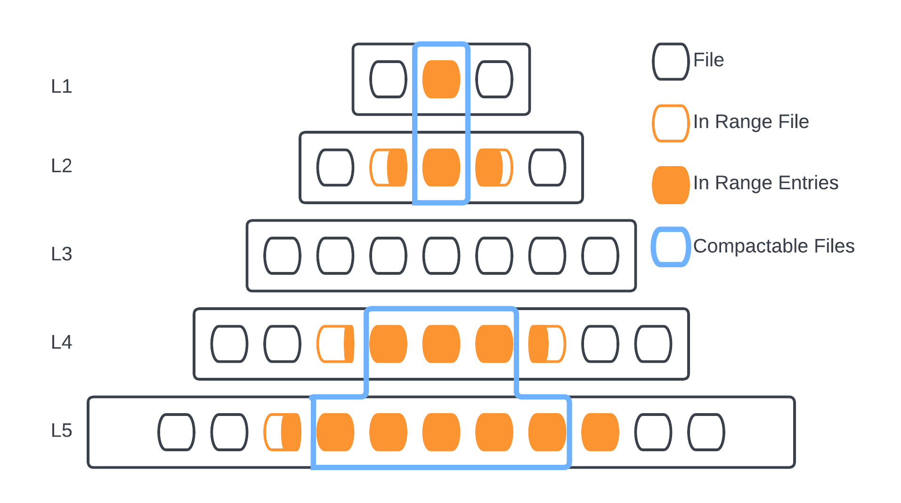
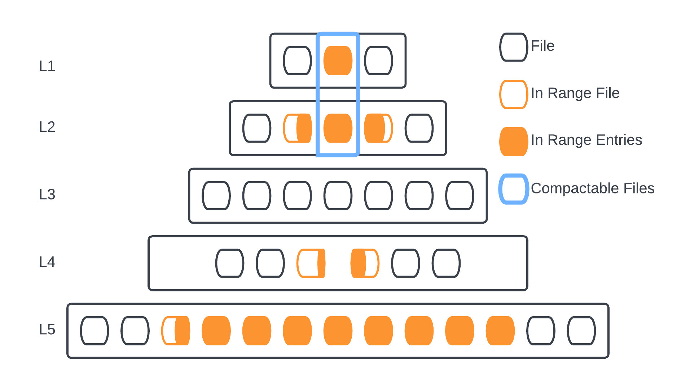

# Range Query Driven Compaction for RocksDB

This module implements a range query driven compaction for RocksDB. This method helps in compacting the files that overlap within a specified key range, resulting in improved query performance. The range query driven compaction is designed to be called when a range query comes in, and it is up to the developer to call this function from the API.

## Overview

The main function, `RangeQueryDrivenCompaction`, accepts two parameters, `start_key` and `end_key`, which define the range of keys to be considered for compaction. This function identifies the overlapping files within the specified range and compacts them.

The following functions have been implemented to support the range query driven compaction:

- `FilterFileThatCanBeCompacted`: Filters the files that can be compacted within the specified range. This function iterates through all the files and checks if they are in the specified range, then filters the files that are completely overlapping with the files in other levels.
- `FilterOnlyInRangeFiles`: Filters the files that are only within the specified range. This function iterates through all the files and checks if they are in the specified range. The filtered files are then returned.
- `FilesToBeCompactedAcrossLevels`: Determines the files to be compacted across different levels. This function iterates over the queue and creates a new `CompactionInputFiles` object and adds it to the vector. This vector contains the `CompactionInputFiles` objects that can be compacted, representing the possible compactions across levels.
- `GetHighestLevelFromCompact`: Finds the highest level from the files that are going to be compacted. This function iterates through the files to be compacted and returns the highest level found.
- `HighestFilesSizeAcrossLevels`: Gets the files that are completely overlapping with the files in other levels and have the maximum size across the selected levels. This function calculates the total size of the files in each level and returns the files with the largest size.

## Usage

To use the range query driven compaction, call the `RangeQueryDrivenCompaction` function with the desired start and end keys:

```cpp
DB* db;
Slice _start_key("key1");
Slice _end_key("key100");
db->RangeQueryDrivenCompaction(_start_key, _end_key);
```

## Modifications

To implement the range query driven compaction, the following files have been modified:

- `db_impl.h`: For defining the function as an interface.
- `db_impl.cc`: For implementing these functions for the default implementation of RocksDB.
- `pessimistic_transaction_db.h`: For adding the function declaration.
- `pessimistic_transaction_db.cc`: For adding the function implementation.
- `stackable_db.h`: For adding the function declaration.
- `db.h`: Public interface for RocksDB, adding the function declaration.
- `db_impl_secondary.h`: For adding the function declaration.
- `db_impl_readonly.h`: For adding the function declaration.
- `compacted_db_impl.h`: For adding the function declaration.

Ensure that you have modified all these files and included them in your project.

## Algorithm
we present the Range Query Driven Compaction algorithm, an efficient approach to manage data in a multi-level storage system. This algorithm operates on file metadata to identify the relevant files that can be compacted within a specific key range and triggers a manual compaction process accordingly. 

The algorithm iterates over all files in each level, comparing them against the provided start and end keys for range query. By executing this process, the algorithm ensures that only the necessary files are compacted, leading to optimized storage and improved query performance. An overview of this operation can be observed in Figures. To utilize this algorithm, it must be explicitly called by the application or user, providing them with greater control over the compaction process. 

One of the key benefits of this algorithm is that developers who are aware of the potential gains from its implementation can easily integrate it into their applications. By understanding the underlying queries and advantages, developers can make informed decisions about when to trigger the algorithm, leading to a better overall system performance.




Additionally, the algorithm will eventually support adjustable threshold settings. This feature, once implemented, can allow developers to set a threshold for range query driven compaction, ensuring that the process is only initiated when the specified conditions are met. This flexibility enables more precise control over the compaction process, ultimately contributing to a more efficient and effective storage system.

This Range Query Driven Compaction algorithm provides a powerful tool for managing data in multi-level storage systems. By offering customizable controls and leveraging file metadata for targeted compaction, this algorithm enables developers to optimize their applications’ performance and storage efficiency.

## Dependencies

This module depends on the RocksDB library. Ensure that you have RocksDB installed and included in your project.

## Build

1. Compile RocksDB first by executing `make static_lib` in parent dir
2. Compile all examples: `cd examples/; make all`
