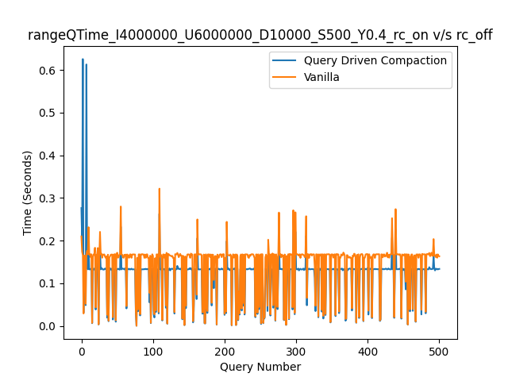
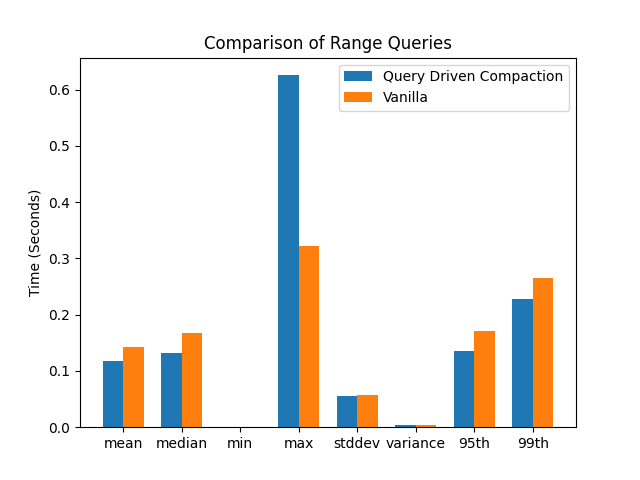
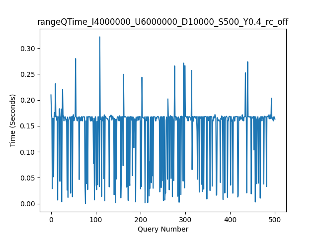
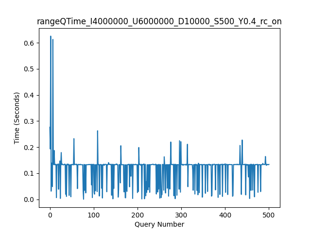

# Readme

## Python Scripts Overview

This repository contains two Python scripts for managing and analyzing the performance of the RocksDB database:

1. `script.py`: This script automates the process of generating workloads, running experiments and creating graphs for a RocksDB project. It is designed to work with specific RocksDB configurations and workload scenarios.
2. `graphs.py`: This script contains functions for generating graphs and histograms to analyze the performance of RocksDB based on the output of simple_example.

## Script1 - `script.py`

### Description

`script.py` is a Python script that automates the process of generating workloads, running experiments and creating graphs for a RocksDB project. It is designed to work with specific RocksDB configurations and workload scenarios. The script performs the following tasks:

1. Initialize directories for workloads, results, and graphs.
2. Remake RocksDB and associated programs (if specified).
3. Generate workloads based on the workload information file.
4. Run experiments on the generated workloads using the simple_example program.
5. Create graphs based on the experiment results.

It will also create and use the following directories:

1. `/tmp/cs561_project1`: This directory is created by `main.py` and serves as the temporary database location for RocksDB. The script stores the RocksDB files generated during the execution of simple_example in this directory. By default, the script cleans up this directory before each run, but you can use the `--keep-database` option to prevent the cleanup.

2. `graphs`: This directory is created by `graphs.py` and stores the generated graphs and histograms. The script saves each graph in a subdirectory named after the corresponding test configuration (e.g., `IUD_QueryDrivenCompaction` or `IUD_Vanilla`). The subdirectories contain the following types of graphs:

    - `graph_<filename>.png`: Individual line plots for RangeQueries
    - `comparison_<filename>_off.png`: Line plots comparing the performance of Query Driven Compaction and Vanilla configurations for RangeQueries
    - `histogram_<filename>_off.png`: Histograms comparing the performance of Query Driven Compaction and Vanilla configurations for RangeQueries

The `graphs` directory is created inside the same directory as the `graphs.py` script. Each time the script generates a new graph or histogram, it saves the output in the appropriate subdirectory within the `graphs` folder. This way, you can easily review and analyze the performance of different RocksDB configurations.

### Dependencies

- Python 3.6 or higher
- RocksDB
- K-V-Workload-Generator
- argparse
- datetime
- os
- pathlib
- shutil
- subprocess
- typing

Additionally, it imports functions from `graphs.py`.

### Usage

To run the script, use the following command:

```
python script.py [options]
```

Available options:

- `--keep-database`: Keep previous files in the /tmp/cs561_project1 database.
- `--del-workload`: Delete all previously generated workloads.
- `--remake`: Run `make clean` in the RocksDB directories.
- `--split-workload`: Run the simple_example separately for IUD (Insert, Update, Delete) and S (Select) workloads.
- `--rc-off`: Turn off Range Compaction.

### Configuration

To configure the workload scenarios, edit the `workloads_info.txt` file. Each line represents a workload scenario in the following format:

```
I <num_inserts> U <num_updates> D <num_deletes> S <num_range_queries> Y <selectivity>
```

Where:
- `<num_inserts>`: Number of insert operations.
- `<num_updates>`: Number of update operations.
- `<num_deletes>`: Number of delete operations.
- `<num_range_queries>`: Number of range query operations.
- `<selectivity>`: Selectivity of the range queries.

Example:

```
I 400 U 60 D 10 S 5 Y 0.01
```

## Script2 - `graphs.py`

### Functions

1. `range_queries_individual_line_plot(file_path: Path, foldername: str)`: Plot individual graph for RangeQueries
2. `range_queries_comparison_line_plot(file_path: Path, vanilla_file_path: Path, foldername: str)`: Plot comparison graph for RangeQueries
3. `range_queries_comparison_histogram(file_path: Path, vanilla_file_path: Path, foldername: str)`: Plot comparison histogram for RangeQueries

### Dependencies

This script relies on the following Python packages:

- csv
- matplotlib
- numpy
- pathlib
- typing

## Example
The graphs generated by the scripts represent the performance of RocksDB for a specific workload with the following configuration:

- 4,000,000 Insertions (I4000000)
- 6,000,000 Updates (U6000000)
- 10,000 Deletions (D10000)
- 500 Range Query Size (S500)
- 0.4 Filter Policy (Y0.4)

There are four graphs generated in this case:

1. **graph_comparison_rangeQTime_I4000000_U6000000_D10000_S500_Y0.4_rc_on_off.png**: This graph shows a line plot comparing the performance of Query Driven Compaction (rc_on) and Vanilla (rc_off) configurations for RangeQueries. The x-axis represents the query number, and the y-axis represents the time taken in seconds. By comparing the two lines, you can observe the differences in performance between the two configurations.



2. **graph_histogram_rangeQTime_I4000000_U6000000_D10000_S500_Y0.4_rc_on_off.png**: This graph shows a histogram comparing the performance of Query Driven Compaction (rc_on) and Vanilla (rc_off) configurations for RangeQueries. The histogram displays the mean, median, minimum, maximum, standard deviation, variance, 95th percentile, and 99th percentile of the time taken for each configuration. By comparing the two sets of bars, you can get a sense of how the performance of the two configurations differs in various aspects.



3. **graph_rangeQTime_I4000000_U6000000_D10000_S500_Y0.4_rc_off.png**: This graph shows an individual line plot for RangeQueries performance in the Vanilla configuration (rc_off). The x-axis represents the query number, and the y-axis represents the time taken in seconds. This graph helps you analyze the performance of the Vanilla configuration in isolation.



4. **graph_rangeQTime_I4000000_U6000000_D10000_S500_Y0.4_rc_on.png**: This graph shows an individual line plot for RangeQueries performance in the Query Driven Compaction configuration (rc_on). The x-axis represents the query number, and the y-axis represents the time taken in seconds. This graph helps you analyze the performance of the Query Driven Compaction configuration in isolation.



You can include these descriptions in your README file and provide the paths to the graphs as examples of the output generated by the scripts. This will help users understand the generated graphs and interpret the results.

## How to Run

1. Make sure you have Python 3 installed on your system.
2. Install the required dependencies.
3. Run `script.py` with the desired options.

Note that the `graphs.py` script is not meant to be run directly, as it contains functions that are imported and used by the `main.py` script.

